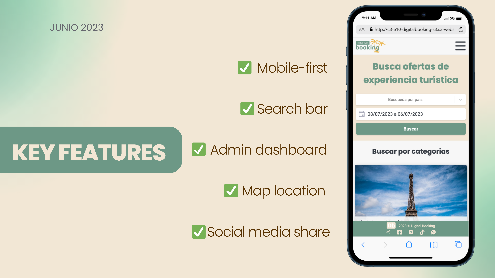

# Digital Booking

Digital Booking "Live the Adventure"  is a website that offers the possibility to book tours and activities in different countries, providing users with the opportunity to live exciting and enriching experiences. The website focuses on promoting adventure tourism and providing a platform for users to find and book their preferred activities.

## Table of contents

  - [MVP Functionalities](#mvp-functionalities)
  - [Responsive webapp](#mvp)
  - [Built with](#built-with)
  - [User stories](#user-stories)

### MVP Functionalities

1. User registration and login.
2. Search and filtering of activities by destination, date, and activity type.
3. Detailed activity pages with relevant information.
4. Ratings and reviews of activities by other travelers.
5. Simple and secure booking process.
6. Booking management and confirmations by users.
7. Integration with social media.
8. User account to save preferences and personal details.

### Responsive webapp

### Built with

- Frontend:
Axios
CSS
HTML
JSON
React.js

- Backend:
Gradle build tools (version 8.1.1)
Java (version 17)
JWT (JSON Web Tokens)
Spring Boot

- Database:
MySQL (version 8.0 and above)

- Infrastructure:
AWS (Amazon Web Services)
GitLab
Terraform
Bash

- Testing:
Jest.js
Postman
React Testing Library
Selenium IDE

### User stories over the project

### Sprint 1
- Support GitLab repository for team members.
- Design infrastructure architecture diagram for project execution (servers, network, databases, and storage).

### Sprint 2
- Deploy EC2 instance on AWS for the Back End web service.
- Connect to an existing MySQL database using a connection string.
- Deploy S3 Bucket to store the Front End (static content).
- Deploy S3 Bucket to store product images.

### Sprint 3
- Deploy code on EC2 web servers and Buckets on AWS.
- Add images to the AWS Bucket to generate URLs.
- Configure the Pipeline.
- Implement CICD (Continuous Integration and Continuous Deployment) and deploy the endpoint in the AWS cloud.
- Configure the frontend Endpoint URL: http://c3-e10-digitalbooking-s3.s3-website.us-east-2.amazonaws.com

### Sprint 4
- Support frontend team in designing the Reservation confirmation page.
- Design the Reservation failure page.
- Design the form using React hooks.

### Other tasks:

- Design a custom Digital Booking logo with an adventure theme using Illustrator.
- Create mock-ups and videos for product presentations.
- Provide support in graphic presentations with creative ideas to make each sprint an engaging experience.